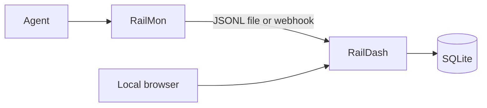

# RailDash

RailDash is a local dashboard for traffic captured by
[RailMon](https://github.com/datrail/railmon). It shows destinations, requests,
responses, failures, tool calls, and `x-rail` presence without requiring a
cloud account or Rail Center.

## Quick start

Python 3.10+ with `venv` and `make` is required:

```bash
git clone https://github.com/datrail/raildash.git
cd raildash
make demo
```

Open <http://127.0.0.1:8000/>. The demo imports the safe sample capture at
[`tests/fixtures/capture.jsonl`](tests/fixtures/capture.jsonl), so a populated
dashboard is visible immediately.

Install the CLI to load your own RailMon capture:

```bash
pip install -e .
raildash load capture.jsonl --serve
```

Or receive live interactions:

```bash
raildash serve
sudo railmon collect --mode http \
  --webhook http://127.0.0.1:8000/webhook/http-interactions
```

## Running the full stack

To run RailMon and RailDash together, or to install from published images, see
**[INSTALL.md](https://github.com/datrail/datrail-project/blob/master/INSTALL.md)** — the full install guide, covering the source-built
stack (`make stack-local`), the registry stack (`make stack`), platform support,
verification, and troubleshooting.

## Architecture



The CLI imports JSONL captures or starts a FastAPI service. Interactions are
stored in SQLite and served by a static browser UI. Re-importing the same
capture is idempotent because records use RailMon's content-derived
`interaction_id`.

## Security

Captured request and response bodies can contain sensitive data. RailDash has
no application authentication or tenancy in this release: keep it on loopback
or behind an authenticated boundary, protect its database and backups, and do
not publish raw captures. Credential headers are redacted, but bodies are not.
Read [SECURITY.md](SECURITY.md) and report vulnerabilities privately through
GitHub Security Advisories.

## Development

```bash
python -m venv .venv
. .venv/bin/activate
pip install -r requirements-dev.txt
make test
```

The OpenAPI contract is [`openapi.yaml`](openapi.yaml). The compose files that
run RailDash alongside RailMon live in
[datrail-project](https://github.com/datrail/datrail-project).

## Related projects

- [RailMon](https://github.com/datrail/railmon) captures agent traffic.
- [DatRail Proxy](https://github.com/datrail/proxy) injects `x-rail` tickets.
- [DatRail Gateway](https://github.com/datrail/gateway) enforces policy.

## License

Apache-2.0. See [LICENSE](LICENSE) and [NOTICE](NOTICE).
