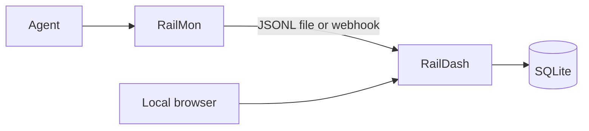

# RailDash

RailDash is a local dashboard for traffic captured by
[RailMon](https://github.com/datrail/railmon). It shows destinations, requests,
responses, failures, tool calls, and `x-rail` presence without requiring a
cloud account or Rail Center.

## Quick start

Python 3.10+ with `venv` and `make` is required:

```bash
git clone https://github.com/datrail/raildash.git
cd raildash
make demo
```

Open <http://127.0.0.1:8000/>. The demo imports the safe sample capture at
[`tests/fixtures/capture.jsonl`](tests/fixtures/capture.jsonl), so a populated
dashboard is visible immediately.

Install the CLI to load your own RailMon capture:

```bash
pip install -e .
raildash load capture.jsonl --serve
```

Or receive live interactions:

```bash
raildash serve
sudo railmon collect --mode http \
  --webhook http://127.0.0.1:8000/webhook/http-interactions
```

## Running the full stack

To run RailMon and RailDash together, or to install from published images, see
**[INSTALL.md](https://github.com/datrail/datrail-project/blob/master/INSTALL.md)** — the full install guide, covering the source-built
stack (`make stack-local`), the registry stack (`make stack`), platform support,
verification, and troubleshooting.

## Architecture



The CLI imports JSONL captures or starts a FastAPI service. Interactions are
stored in SQLite and served by a static browser UI. Re-importing the same
capture is idempotent because records use RailMon's content-derived
`interaction_id`.

## Security

Captured request and response bodies can contain sensitive data. RailDash has
no application authentication or tenancy in this release: keep it on loopback
or behind an authenticated boundary, protect its database and backups, and do
not publish raw captures. Credential headers are redacted, but bodies are not.
Read [SECURITY.md](SECURITY.md) and report vulnerabilities privately through
GitHub Security Advisories.

## Development

```bash
python -m venv .venv
. .venv/bin/activate
pip install -r requirements-dev.txt
make test
```

## ASP v1 local custody

RailDash retains validated RailMon evidence bundles as immutable ASPs and can
lock any stored ASP as an alignment version. Every one of these steps works
from either the CLI or the live dashboard — the dashboard does not need the
server stopped, and the CLI is a thin wrapper over the same underlying calls
(standing decision: the ASP feature must not depend on the CLI):

```bash
raildash asp load evidence-bundle.json
raildash asp list
raildash asp lock asp-... --version v1.0
raildash asp switch aspver-...
```

For a bundle without a complete deployment or host-scoped Compose identity,
pass `--agent-key NAME` to `asp load` (HTTP: `?agent_key=NAME` or an
`X-RailDash-Agent-Key` header, see below). Replaying identical bytes is
idempotent; reusing a bundle ID with different bytes is rejected. `asp export`
preserves the exact received bytes, and `asp drift-export` writes full
baseline/current evidence. Both refuse public output directories and create
owner-only files. Use `asp prune --keep-count 100 --max-age-days 30` to apply
retention bounds; the same bounds run automatically after each load. Set
`RAILDASH_ASP_RETENTION_COUNT`/`RAILDASH_ASP_RETENTION_DAYS`, or persist a
change with `raildash asp retention-set --keep-count N --max-age-days N` (or
the dashboard's retention settings panel) so it survives a restart without
re-exporting an env var. Locked versions and their ASPs are never pruned.

### HTTP: evidence-bundle ingest

`POST /v1/evidence-bundles` is RailDash's counterpart to Rail Center's own
`POST /v1/evidence-bundles` — same path and general shape (raw bytes in, a
202 with a `duplicate` flag on accept), RailDash's own dedup semantics
(content digest, not a client-asserted id). A scanner (RailMon's, or any
script) can deliver a bundle without the CLI:

```python
import requests

requests.post(
    "http://127.0.0.1:8000/v1/evidence-bundles",
    params={"agent_key": "optional-explicit-identity"},
    data=raw_bundle_bytes,          # exact bytes, not reserialized, not multipart
    headers={"X-RailDash-Token": token},  # see "Local write safety" below
).raise_for_status()
```

Bounded to `RAILDASH_MAX_EVIDENCE_BUNDLE_BYTES` (default 1,048,576 bytes,
mirroring Rail Center's `MAX_EVIDENCE_BUNDLE_BYTES`). Responses: `202
{"accepted": true, "asp_id": "asp-...", "duplicate": bool}` on accept; `409`
if an id/identity already names different stored bytes; `422` for a
malformed or unresolvable bundle.

### HTTP: the rest of custody, and local write safety

`GET /api/asps`, `/api/alignments`, and per-ASP `state`/`drift` stay
unauthenticated, redacted metadata (change names and field names, never
evidence values or digests) — unchanged from before. Everything that mutates
custody state, plus the two reads that carry exact evidence
(`GET /api/asps/{asp_id}/bundle`, `GET /api/asps/{asp_id}/drift/explained`,
which is the per-attribute old/new/tier detail behind the dashboard's "drift
explained" view), requires a per-start random token as an `X-RailDash-Token`
header:

| Route | CLI equivalent |
| --- | --- |
| `POST /v1/evidence-bundles` | `asp load` |
| `POST /api/asps/{asp_id}/lock` `{"version": "..."}` | `asp lock` |
| `POST /api/alignments/{id}/switch` | `asp switch` |
| `POST /api/asps/{asp_id}/accept-drift` `{"version": "..."}` | `asp lock` + `asp switch` in one call |
| `GET`/`POST /api/settings/asp-retention` | `asp retention-set` |
| `POST /api/asps/prune` | `asp prune` |
| `GET /api/asps/{asp_id}/bundle` | `asp export` |
| `GET /api/asps/{asp_id}/drift/explained` | `asp drift-export` |

`raildash serve` prints the token, and also writes it 0600 to `<db
path>.token` for a co-located script to read (gitignored, alongside the
database). RailDash injects the token into the page it serves itself (a
`<meta name="raildash-token">` tag), so the dashboard's own fetch calls
attach it automatically — same-origin only, so a cross-site page cannot read
it and cannot forge a write even though a browser will happily send
loopback requests. This is the same pattern Jupyter's notebook server uses,
and it is why the token is a CSRF defense as well as an access control.

`serve` still binds `127.0.0.1` by default; that has not changed. Passing
`--host 0.0.0.0` (or any non-loopback address) is a deliberate, documented
opt-in to reach RailDash from another host, and the token requirement still
applies unchanged — exposing the port does not by itself expose the write
routes.

The existing capture and `/api/profile` paths are unchanged. The pure
validator/comparator and versioned JSON Schemas live under `raildash.asp`
and `raildash/schemas/`.

Run `make asp-acceptance` for the deterministic replay, controlled-drift,
version-switch, and incompatible-rule-pack flow. The clean-build and live demo
handoff is documented in [`docs/asp-v1-acceptance.md`](docs/asp-v1-acceptance.md).

The OpenAPI contract is [`openapi.yaml`](openapi.yaml). The compose files that
run RailDash alongside RailMon live in
[datrail-project](https://github.com/datrail/datrail-project).

## Related projects

- [RailMon](https://github.com/datrail/railmon) captures agent traffic.
- [DatRail Proxy](https://github.com/datrail/proxy) injects `x-rail` tickets.
- [DatRail Gateway](https://github.com/datrail/gateway) enforces policy.

## License

Apache-2.0. See [LICENSE](LICENSE) and [NOTICE](NOTICE).
