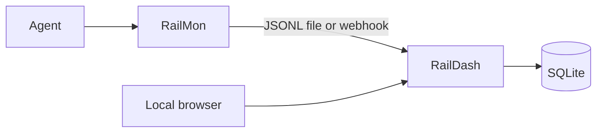

# RailDash

> **Just want to run DatRail?** Start at
> [datrail-project](https://github.com/datrail/datrail-project#quick-start):
> one `docker compose up -d` runs RailMon, RailDash and a demo agent
> together. This README covers RailDash on its own.

RailDash is a local dashboard for traffic captured by
[RailMon](https://github.com/datrail/railmon). It shows destinations, requests,
responses, failures, tool calls, and `x-rail` presence without requiring a
cloud account or Rail Center.

It also keeps the evidence bundles RailMon's scanner delivers as Agent
Security Profiles (ASPs): what an agent is set up to use and was observed
doing. You can lock an ASP as a baseline and see later drift from it. These
terms are defined in the
[DatRail glossary](https://github.com/datrail/datrail-project/blob/master/docs/glossary.md).

## Quick start

Python 3.10+ with `venv` and `make` is required:

```bash
git clone https://github.com/datrail/raildash.git
cd raildash
make demo
```

Open <http://127.0.0.1:8000/>. The demo imports the safe sample capture at
[`tests/fixtures/capture.jsonl`](tests/fixtures/capture.jsonl), so a populated
dashboard is visible immediately.

Install the CLI to load your own RailMon capture:

```bash
pip install -e .
raildash load capture.jsonl --serve
```

Or receive live interactions. Start RailDash, then point RailMon's collector
at its webhook:

```bash
raildash serve
docker run --rm --privileged --pid host --network host railmon collect \
  --mode http --webhook http://127.0.0.1:8000/webhook/http-interactions
```

`railmon collect` is the RailMon container image's command, so it exists only
inside that container (`railmon` here is an image built from the
[RailMon](https://github.com/datrail/railmon) repository). There is no `sudo
railmon collect` on the host. A native RailMon build runs the collector binary
directly with the same `--mode`/`--webhook` flags and no `collect` command;
see RailMon's README.

The capture webhooks (`/webhook/http-interactions`, `/webhook/events`) stay
open. A batch that also carries the local write token in `X-RailDash-Token`
(see "Local write safety" below) is stored as *authenticated*; one without it,
or with a wrong one, is stored exactly as before and marked unauthenticated.
Captures loaded with `raildash load` are unauthenticated too. The Data
Guardrail judges authenticated captures only. A collector that sends the
token also posts `POST /webhook/heartbeat` (token required) every 60 s while
at least one tap is attached, with `{"collector_id", "taps_attached",
"sent_at"}`; RailDash keeps the last one per collector, timed by its own
clock, so a dead collector is not mistaken for an idle agent. When a batch
that carries the token is refused with any 4xx (too large, too deep, not
valid JSON, the wrong shape or content type), RailDash records the time:
none of that traffic was stored, so the guardrail's request rules can't read
Held for a while after it. A refused
batch without the token is not recorded. Neither the mark, the heartbeats nor
the refusals are shown on an unauthenticated read route.

## Running the full stack

To run RailMon and RailDash together, use
[datrail-project](https://github.com/datrail/datrail-project#quick-start):
clone it with `--recursive` and run `docker compose up -d`, which builds both
images from source.
[INSTALL.md](https://github.com/datrail/datrail-project/blob/master/INSTALL.md)
covers prerequisites, platform support, settings (including the RailDash
token), published images, verification, and troubleshooting.

## Architecture


```mermaid
flowchart LR
  agent[Agent] --> railmon[RailMon]
  railmon -->|JSONL file or webhook| raildash[RailDash]
  raildash --> sqlite[(SQLite)]
  browser[Local browser] --> raildash
```

The CLI imports JSONL captures or starts a FastAPI service. Interactions are
stored in SQLite and served by a static browser UI. Re-importing the same
capture is idempotent because records use RailMon's content-derived
`interaction_id`.

## Security

Captured request and response bodies can contain sensitive data. RailDash has
no application authentication or tenancy in this release: keep it on loopback
or behind an authenticated boundary, protect its database and backups, and do
not publish raw captures. Credential headers are redacted, but bodies are not.
Read [SECURITY.md](SECURITY.md) and report vulnerabilities privately through
GitHub Security Advisories.

## Development

```bash
python -m venv .venv
. .venv/bin/activate
pip install -r requirements-dev.txt
make test
```

## ASP v1 local custody

RailDash retains validated RailMon evidence bundles as immutable ASPs and can
lock any stored ASP as an alignment version. Every workflow except locking
without activating works from either the CLI or the live dashboard, and
neither needs the server stopped: the CLI is an optional thin wrapper over
the same underlying calls and can run against the database while `raildash
serve` is using it. The dashboard's lock buttons lock and activate in one
step (`asp baseline`); locking without activating (`asp lock`) is a CLI and
HTTP operation:

```bash
raildash asp load evidence-bundle.json
raildash asp list
raildash asp baseline asp-... --version v1.0   # lock if needed, then activate
raildash asp lock asp-... --version v1.0
raildash asp switch aspver-...
```

The dashboard lists every received ASP newest first, marked as the current
baseline, locked, or a candidate. Any of them can be made the baseline from
that list, and each can be downloaded exactly as it was received. Making an
ASP the baseline, or accepting a drifted one, is idempotent: an ASP is locked
at most once, so repeating the action reuses its alignment version.

### Files: asked and kernel-observed

A capture's profile lists the files its tool calls *asked* to read or write
(**Files · asked**, from the captured conversation). Beside it,
**Files · kernel-observed** lists what RailMon's filesnoop saw the sandbox
actually open: the `observed_file_access` attribute (path, read, write, exec,
layer) of the latest ASP received for each sandbox the capture names, or, for
a capture that names no sandbox (a single-agent RailMon), the latest ASP of
every sandbox, said as such. The two are never merged: one is what the model
requested, the other what the kernel observed. The list comes from
`GET /api/profile/kernel-file-access?session_id=...` (token-gated, since the
paths are evidence values).

`observed_file_access` takes part in drift like any attribute. When it
changes, the drift view lists the paths by what changed (newly written, run,
read or opened; no longer written, run, read or opened) instead of two raw
lists. A reading that declares a `window` (see evidence bundle v2 below)
lists only what is newly seen, since a quieter window is not something
stopped.

The value of an attribute RailMon publishes as *dynamic*
(`raildash/schemas/attribute-groups.json`, vendored from RailMon) never takes
part in drift. Today that is `agent_instance`, where this copy runs: the
agent container's hostname, id and host pid, and the scan's own fqdn, pid and
working directory. A restart, move or recreate changes them. Everything but
its value still counts, as for `container_identity`, so a probe that stops
answering is drift. The ASP keeps the value; "Inspect evidence" shows it.

For a bundle without a complete deployment or host-scoped Compose identity,
pass `--agent-key NAME` to `asp load` (HTTP: `?agent_key=NAME` or an
`X-RailDash-Agent-Key` header, see below). Replaying identical bytes is
idempotent; reusing a bundle ID with different bytes is rejected. `asp export`
preserves the exact received bytes, and `asp drift-export` writes full
baseline/current evidence. Both refuse public output directories and create
owner-only files. Use `asp prune --keep-count 100 --max-age-days 30` to apply
retention bounds; the same bounds run automatically after each load. Set
`RAILDASH_ASP_RETENTION_COUNT`/`RAILDASH_ASP_RETENTION_DAYS`, or persist a
change with `raildash asp retention-set --keep-count N --max-age-days N` (or
the dashboard's retention settings panel) so it survives a restart without
re-exporting an env var. Locked versions and their ASPs are never pruned.

### HTTP: evidence-bundle ingest

`POST /v1/evidence-bundles` is RailDash's counterpart to Rail Center's own
`POST /v1/evidence-bundles` — same path and general shape (raw bytes in, a
202 with a `duplicate` flag on accept), RailDash's own dedup semantics
(content digest, not a client-asserted id). A scanner (RailMon's, or any
script) can deliver a bundle without the CLI:

```python
import requests

requests.post(
    "http://127.0.0.1:8000/v1/evidence-bundles",
    params={"agent_key": "optional-explicit-identity"},
    data=raw_bundle_bytes,          # exact bytes, not reserialized, not multipart
    headers={"X-RailDash-Token": token},  # see "Local write safety" below
).raise_for_status()
```

Bounded to `RAILDASH_MAX_EVIDENCE_BUNDLE_BYTES` (default 1,048,576 bytes,
mirroring Rail Center's `MAX_EVIDENCE_BUNDLE_BYTES`). Responses: `202
{"accepted": true, "asp_id": "asp-...", "duplicate": bool}` on accept; `409`
if an id/identity already names different stored bytes; `422` for a
malformed or unresolvable bundle.

### HTTP: the rest of custody, and local write safety

`GET /api/asps`, `/api/asps/history`, `/api/alignments`, per-ASP
`state`/`drift`, and `GET /api/settings/asp-retention` are unauthenticated,
redacted metadata (counts, change names and field names, never evidence
values or digests). Everything that mutates
custody state, plus the five reads that carry exact evidence
(`GET /api/asps/{asp_id}/bundle`, `GET /api/asps/{asp_id}/raw`,
`GET /api/asps/{asp_id}/drift/explained`,
which is the per-attribute old/new/tier detail the dashboard shows under a
drifted ASP's change list, and `GET /api/profile/kernel-file-access`, described under
"Files: asked and kernel-observed" above, and a guardrail's detail, described
under "HTTP: the Data Guardrail" below), requires a local write token as
an `X-RailDash-Token` header:

| Route | CLI equivalent |
| --- | --- |
| `POST /v1/evidence-bundles` | `asp load` |
| `POST /api/asps/{asp_id}/lock` `{"version": "..."}` | `asp lock` |
| `POST /api/alignments/{id}/switch` | `asp switch` |
| `POST /api/asps/{asp_id}/baseline` `{"version": "..."}` | `asp baseline` (lock if needed, then switch) |
| `POST /api/asps/{asp_id}/accept-drift` `{"version": "..."}` | `asp baseline` |
| `POST /api/settings/asp-retention` | `asp retention-set` |
| `POST /api/asps/prune` | `asp prune` |
| `GET /api/asps/{asp_id}/bundle` | `asp export` |
| `GET /api/asps/{asp_id}/raw` (exact received bytes) | `asp export` |
| `GET /api/asps/{asp_id}/drift/explained` | `asp drift-export` |

The token is stable across restarts, so a RailMon configured once keeps
delivering after RailDash restarts. RailDash takes it from, in order:

1. `RAILDASH_TOKEN`, if set (at least 16 characters of `A-Z a-z 0-9 - _ . ~ +
   / =`, e.g. `openssl rand -base64 32`) — handy when RailMon's
   `RAIL_RAILDASH_TOKEN` is set from the same secret before either starts;
2. otherwise `<db path>.token` from a previous start;
3. otherwise a new random token, written 0600 to `<db path>.token`
   (gitignored, alongside the database; `/data/raildash.db.token` in the
   container).

At startup RailDash logs where the token came from (`raildash: local write
token reused from raildash.db.token`), never the token itself — read it with
`cat raildash.db.token`. To rotate it, delete that file (or change
`RAILDASH_TOKEN`) and restart, then give RailMon the new value.

RailDash injects the token into the page it serves itself (a
`<meta name="raildash-token">` tag), so the dashboard's own fetch calls
attach it automatically — same-origin only, so a cross-site page cannot read
it and cannot forge a write even though a browser will happily send
loopback requests. This is the same pattern Jupyter's notebook server uses,
and it is why the token is a CSRF defense as well as an access control.

`serve` still binds `127.0.0.1` by default; that has not changed. Passing
`--host 0.0.0.0` (or any non-loopback address) is a deliberate, documented
opt-in to reach RailDash from another host, and the token requirement still
applies unchanged — exposing the port does not by itself expose the write
routes.

### HTTP: the Data Guardrail

DR-184's guardrail checks every ASP and every authenticated capture of an
agent against four rules the user adopted: allowed uploads, saved-file
kinds, no service ports, and no out-of-spec calls (design:
railxia/docs `design/2026-10-07-data-guardrail`). The store checks them as
evidence arrives, whichever way it arrives. Every guardrail route needs the
token, including both reads:

| Route | What it does |
| --- | --- |
| `GET /api/guardrails` | each agent's state (`held`, `violated`, `unverified`, `no_guardrail`), without item values |
| `GET /api/guardrails/{agent_ref}` | state, rows, *declared since gN* offers, versions, history, and the proposal before one is adopted |
| `POST /api/alignments/{id}/guardrail` `{}` or `{"rules": {...}}` | Adopt the proposal, or the proposal as edited |
| `POST /api/guardrail-versions/{id}/edit` `{"rules": {...}}` | Edit: a new version from the active one |
| `POST /api/guardrail-versions/{id}/switch` | Switch to an earlier version |
| `POST /api/guardrails/{agent_ref}/turn-off` | Turn off (No guardrail) |
| `POST /api/guardrail-rows/{row_id}/acknowledge` | Acknowledge a row; a later hit re-opens it |
| `POST /api/guardrail-rows/{row_id}/allow` | Allow this: a new version that allows the row's item |
| `POST /api/guardrails/{agent_ref}/offers/allow` or `.../dismiss` `{"kind": "host", "value": "..."}` | Allow or dismiss a newly declared host or MCP server |

`RAILDASH_GUARDRAIL_MAX_OPEN_ROWS` (default 1000) caps the unacknowledged
rows per agent before further items count in one overflow row, and
`RAILDASH_GUARDRAIL_ACK_RETENTION_DAYS` (default 30) is how long an
acknowledged row is kept after its last hit.

### Multi-agent collections (evidence bundle v2)

RailMon run with `--target-manifest` delivers one evidence-bundle v2
collection per scan: a shared sandbox scope plus one scope per declared
agent. It locks, switches and drifts exactly like a v1 bundle. Its drift
results use `drift_contract_version: 2`, where every change carries an
`agent_key`: `null` for the sandbox scope and attestations, otherwise the
agent the change happened in. Three change types are new:

| Change | Meaning |
| --- | --- |
| `AGENT_CHANGED` `["discovery_status"]` | A declared agent's discovery moved, e.g. `available` → `not_found` when its process is gone. Its attribute and source changes follow, scoped to it. |
| `AGENT_ADDED` / `AGENT_REMOVED` | The collection gained or lost an agent scope. This happens only under a deployment identity (`RAIL_DEPLOYMENT`/`RAIL_NAMESPACE` or the compose labels). With no deployment identity, the sorted agent keys *are* the identity. A manifest that declares a different set of agents is then a new subject with no alignment of its own, offered for locking, and the old subject's card receives no new ASPs. Set a deployment identity to see a manifest change as drift. |

An attribute whose reading declares RailMon's optional `window` member
(the v2 schema's `$defs.attribute.properties.window`) holds only
what the collector's observation window saw, so its list is compared as a
window: an item the current window did not see is not a removal, the
`ignore` keys (traffic counts such as a destination's `count`) are not part
of an item, and a `union` key (such as a file's `write`) is drift only when
it turns true. A new item or a newly-true `union` key is the usual
`ATTRIBUTE_CHANGED` with `value` in its `fields`; a window that saw less is
no change at all, and the member itself is never drift. The current
reading's declaration is used, else the baseline's, so a baseline locked
before RailMon emitted it compares the same way. Status and the other
qualifiers are still compared exactly, and a reading without a window on
either side is compared exactly as before. The emitted shape is unchanged,
so this stays `drift_contract_version: 2`.

A v1 bundle compared with a v2 baseline (or the reverse) is
`CONTRACT_MISMATCH`. v1 comparisons still emit contract v1 unchanged.
Schemas: `raildash/schemas/drift-result-v1.schema.json` and
`drift-result-v2.schema.json`.

The existing capture and `/api/profile` paths are unchanged. The pure
validator/comparator and versioned JSON Schemas live under `raildash.asp`
and `raildash/schemas/`.

The Data Guardrail's contract (DR-184) is
`raildash/schemas/guardrail-version-v1.schema.json`, and its pure evaluator
is `raildash.guardrail`. Its storage and the two ingest hooks that call it
are `raildash.guardrail_store`, served by the routes under "HTTP: the Data
Guardrail" above. The dashboard's Data Guardrail panel, beside the alignment
panel, shows each agent's state and rows and offers every action: adopt the
proposal (as is or edited), Allow this, Acknowledge, Allow or Dismiss a
declared host, Edit, Switch and Turn off.

Run `make asp-acceptance` for the deterministic replay, controlled-drift,
version-switch, and incompatible-rule-pack flow. The clean-build and live demo
handoff is documented in [`docs/asp-v1-acceptance.md`](docs/asp-v1-acceptance.md).

The OpenAPI contract is [`openapi.yaml`](openapi.yaml). The compose files that
run RailDash alongside RailMon live in
[datrail-project](https://github.com/datrail/datrail-project).

## Related projects

- [RailMon](https://github.com/datrail/railmon) captures agent traffic.
- [DatRail Proxy](https://github.com/datrail/proxy) injects `x-rail` tickets.
- [DatRail Gateway](https://github.com/datrail/gateway) enforces policy.

## License

Apache-2.0. See [LICENSE](LICENSE) and [NOTICE](NOTICE).
